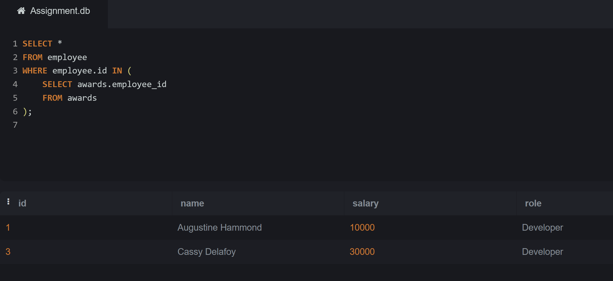
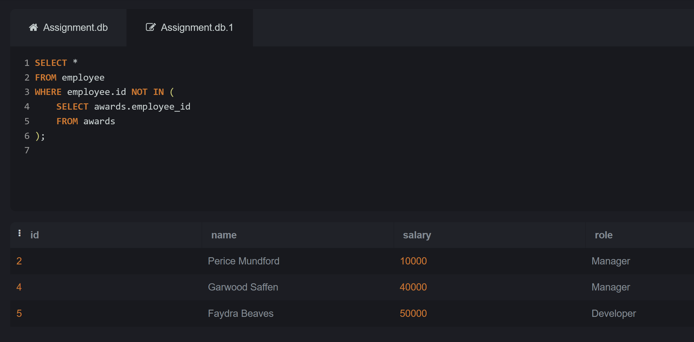
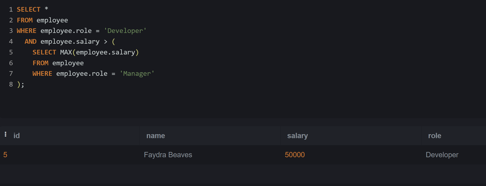
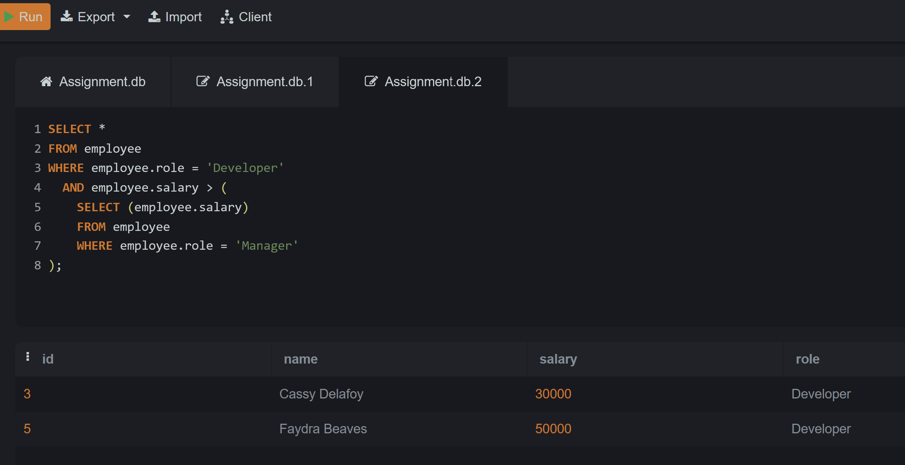
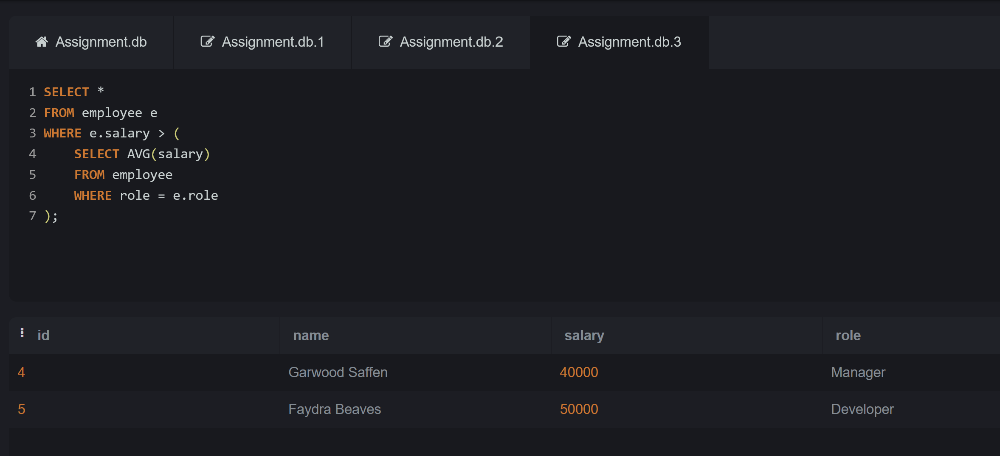

# SQL-Lab2

# We will use the Employees and Awards table below:

 

### Q1: Choose all employees who have received an award (Nested Query)?
Query:
``` sql
SELECT *
FROM employee
WHERE employee.id IN (
    SELECT awards.employee_id
    FROM awards
);
```
Output:


### Q2: Choose all employees who have never received an award (Nested Query)?
Query:
``` sql
SELECT * 
FROM employee 
WHERE employee.id NOT IN ( 
    SELECT awards.employee_id 
  FROM awards
  );
```
Output:

 
### Q3: Choose all Developers who make more than all Managers combined (Nested Query)?
Query:
``` sql
SELECT *
FROM employee
WHERE employee.role = 'Developer'
  AND employee.salary > (
    SELECT MAX(employee.salary)
    FROM employee
    WHERE employee.role = 'Manager'
);
```
Output:

 
### Q4: Choose all Developers who make more money than any Manager (Nested Query)?
Query:
``` sql
 SELECT *
FROM employee
WHERE employee.role = 'Developer'
  AND employee.salary > (
    SELECT (employee.salary)
    FROM employee
    WHERE employee.role = 'Manager'
);
```
Output:

 
### Q5: Choose all employees whose salaries are higher than the average for their position. (Nested Query)?
Query:
``` sql
SELECT *
FROM employee e
WHERE e.salary > (
    SELECT AVG(salary)
    FROM employee
    WHERE role = e.role
);
```
Output:

